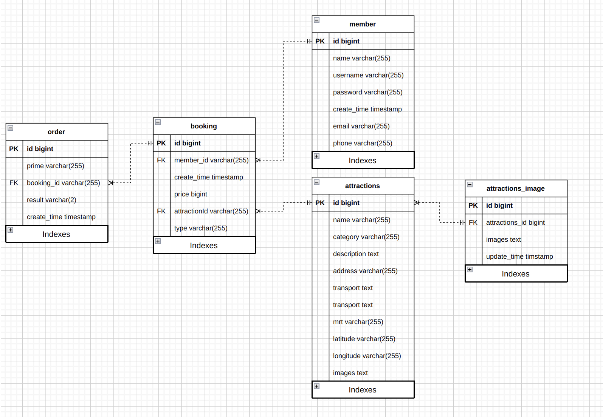

# TODO

-   [x] ER model
-   [x] insert data to database
-   [ ] redis dockerfile
-   [ ] redis with mysql
-   [ ] k8s workflow using git action

# ER Model

# ref

-   [regexp](http://gskinner.com/RegExr/?2tr2n)
-   [mysql set to utf8 with dockerfile](https://stackoverflow.com/questions/45729326/how-to-change-the-default-character-set-of-mysql-using-docker-compose)
