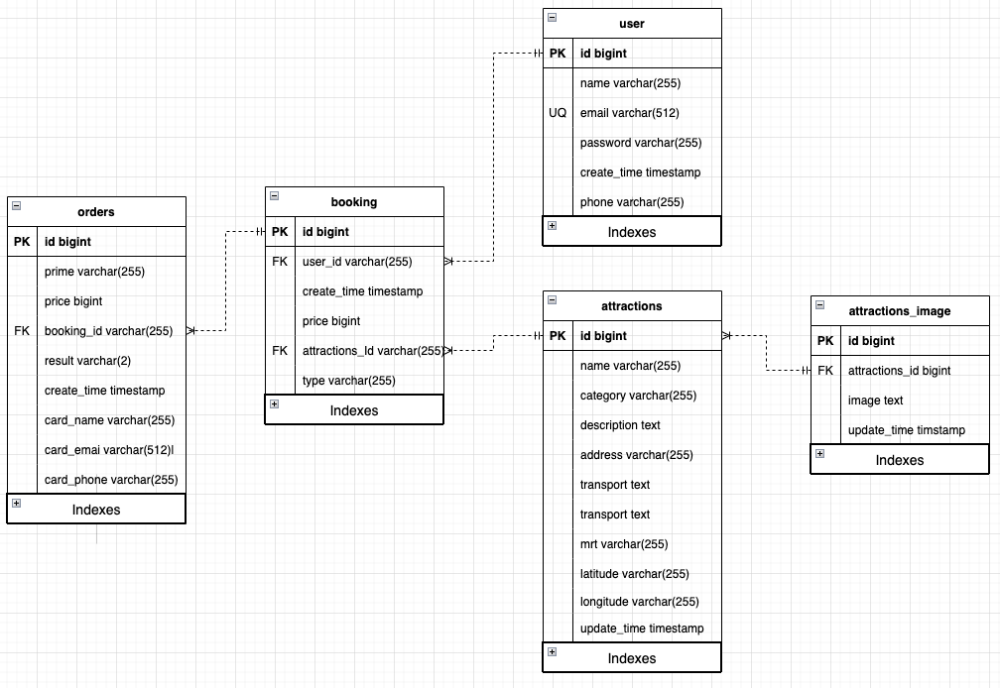

# TODO

-   [x] ER model
-   [x] insert data to database
-   [x] redis dockerfile -> no need
-   [x] redis with mysql -> no need
-   [x] k8s workflow using git action -> no need
-   [x] docker to taipei time zone

## Functionalities

-   [ ] Image distribute to CDN (EC2 and RDS)

## User

-   [x] user's order history
-   [ ] JWT login user access

## Orders

-   [x] check client's order is valid or not

## Booking

-   [x] Shopping Cart
-   [x] booking history
-   [x] orders history for frontend page
-   [x] Check number of goods in the store house before place an order -> no store house needed
-   [x] minus one after an order been placed -> no store house needed
-   [x] plus one after an order been deleted -> no store house needed

## Test

-   [ ] Unit test

# ER Model

# ref

-   [regexp](http://gskinner.com/RegExr/?2tr2n)
-   [mysql set to utf8 with dockerfile](https://stackoverflow.com/questions/45729326/how-to-change-the-default-character-set-of-mysql-using-docker-compose)
