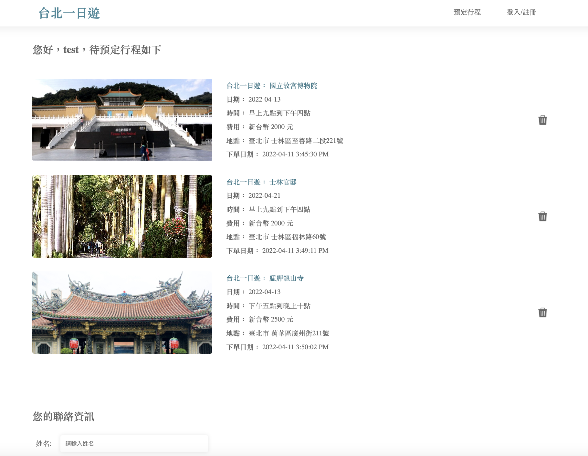
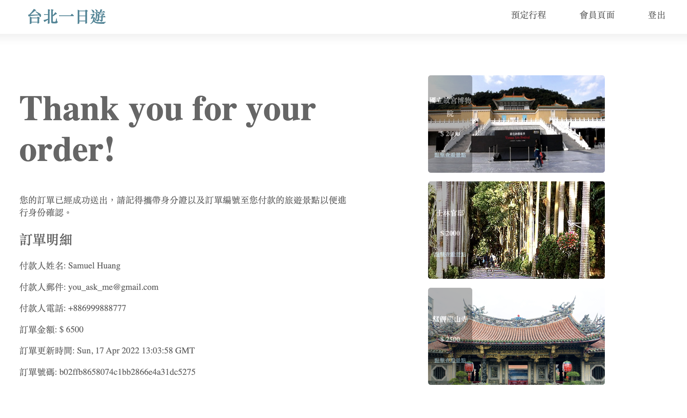

- [APP screen shot](#app-screen-shot)
- [How to start](#how-to-start)
  - [Depandancies](#depandancies)
  - [Enjoy!](#enjoy)
  - [ER Model](#er-model)
- [TODO](#todo)
  - [Functionalities](#functionalities)
  - [User](#user)
  - [Orders](#orders)
  - [Booking](#booking)
  - [Follow-up implementation](#follow-up-implementation)
- [Reference](#reference)
  - [TapPay API](#tappay-api)
  - [Useful links](#useful-links)

# APP screen shot

- 
- 
- 
- 

# How to start

## Depandancies

-   Docker
-   Docker-compose
-   watchman-make
-   [TapPay API](#tappay-api)

## Enjoy!

make sure you have modify `.env.example`, `server/config.example/`, `server/client/config` files and just `make start` then you can start to develop your Taipei day trip app!

```bash
$ git clone https://github.com/TWcamel/taipei-day-trip-website.git
$ cd taipei-day-trip-website
$ cp .env.example .env #change docker variables for your app
$ cp -r server/config.example server/config #change mysql variables for your app
$ cp -r server/client/config.example server/client/config #change TapPay API variables for your app
$ make start
```

## ER Model


# TODO

## Functionalities

-   [ ] Image distribute to CDN (EC2 with RDS)
-   [x] docker to taipei time zone

## User

-   [x] user's order history

## Orders

-   [x] verify client's orders

## Booking

-   [x] shopping cart
-   [x] booking history
-   [x] check number of goods in the store house before place an order -> no store house needed

## Follow-up implementation

-   [ ] re-design user login for better security (JWT+cookie)
-   [ ] recommendation algo for trending attractions
-   [ ] cache for better UX
-   [ ] Unit test
-   [ ] CI\CD workflow using git action

# Reference

## TapPay API

-   [official website](https://www.tappaysdk.com/zh/)

## Useful links

-   [regexp](http://gskinner.com/RegExr/?2tr2n)
-   [mysql set to utf8 with dockerfile](https://stackoverflow.com/questions/45729326/how-to-change-the-default-character-set-of-mysql-using-docker-compose)
